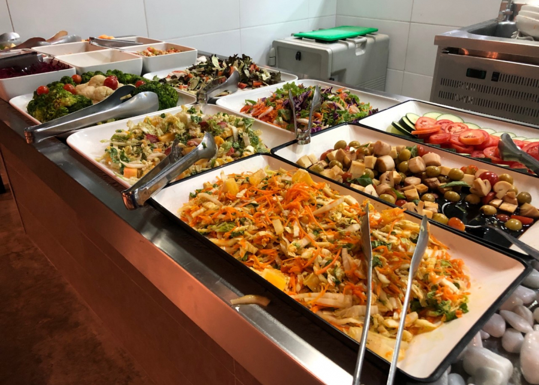

# DW1 - Desenvolvimento WEB 1

## 18/03/2025 - ter
Apresentação da disciplina. Posicionamento da disciplina no curso. CSS. HTML. JS Algoritmos +. Regras de negócio. Solicitar que criem contas no github.

## Teremos um cardápio variado

  
  
Não é tudo para uma única refeição.

## 20/03/2025 - qui
Subir para github. Baixar do github.

## 25/03/2025 - ter
Clonar o próprio repositório.

DOM (Document Object Model)
https://www.w3schools.com/whatis/whatis_htmldom.asp

Recapitulação JS. Conteúdos vistos em algoritmos. Exercícios.
Desenvolvimento WEB

## 27/03/2025 - qui
Recapitulação da aula anterior (DOM)
Recapitulação JS e conteúdos vistos em algoritmos. 

Exercícios com manipulação do DOM.

https://github.com/rjhalmeman/dw1/blob/main/01_bimestre/Lista%20de%20Exerc%C3%ADcios%2001.md

## 01/04/2025 - ter
Iniciantes (código fonte tv)
https://www.youtube.com/watch?v=3-3lTJlBU78

Terminologia. Uso de IA generativa de forma produtiva. CSS e JS.

## 08/04/2025 - ter
Terminologia. Uso de IA generativa de forma produtiva. CSS e JS.

## 10/04/2025 - qui
Terminologia. Uso de IA generativa de forma produtiva. CSS e JS.

## 15/04/2025 - ter
Exercícios. Construção de prompts.

## 17/04/2025 - qui
Seletores CSS

## 22/04/2025 - ter
Exercícios com seletores css

## 24/04/2025 - qui
Seletor de elementos

## 29/04/2025 - ter
Exercícios com seletores de elementos.

## 06/05/2025 - ter
seletores de classe

## 08/05/2025 - qui
Avaliação 1º Bimestre

