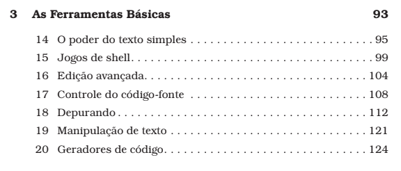

## DW1 - Desenvolvimento WEB 1

## 18/03/2025 - ter
Apresentação da disciplina. Posicionamento da disciplina no curso. CSS. HTML. JS Algoritmos +. Regras de negócio. Solicitar que criem contas no github.

## Teremos um cardápio variado

  
  
Não é tudo para uma única refeição.

## 20/03/2025 - qui
Subir para github. Baixar do github.

## 25/03/2025 - ter
Clonar o próprio repositório.

DOM (Document Object Model)
https://www.w3schools.com/whatis/whatis_htmldom.asp

Recapitulação JS. Conteúdos vistos em algoritmos. Exercícios.
Desenvolvimento WEB

## 27/03/2025 - qui
Recapitulação da aula anterior (DOM)
Recapitulação JS e conteúdos vistos em algoritmos. 

Exercícios com manipulação do DOM.

https://github.com/rjhalmeman/dw1/blob/main/01_bimestre/Lista%20de%20Exerc%C3%ADcios%2001.md

- Exercício feito em sala de aulas
https://github.com/rjhalmeman/dw1/tree/main/01_bimestre/2025-03-27%20-%20CorDoFundo

## 01/04/2025 - ter

Terminologia. Uso de IA generativa de forma produtiva. CSS e JS.

Navegando no sistema de pastas 
cd
cd ..

Estrutura de diretórios (pastas). Entender como funcionam os caminhos é essencial para organização de código e para referenciar arquivos (documentos) externos.

Exercício feito em sala
https://github.com/rjhalmeman/dw1/tree/main/01_bimestre/2025-04-01%20-%20Imagens

Tag IMG

## 03/04/2025 - Quinta
Exercícios

## 08/04/2025 - ter

## 📺 [Iniciantes (código fonte tv)](https://www.youtube.com/watch?v=3-3lTJlBU78)

Estrutura de diretórios (pastas)
Entender como funcionam os caminhos é essencial para organização de código

Terminologia. Uso de IA generativa de forma produtiva. CSS e JS.

Enviar dados de uma página para outra.

## 10/04/2025 - qui
Terminologia. Uso de IA generativa de forma produtiva. CSS e JS.

Múltiplas páginas

## [15/04/2025 - ter](https://github.com/rjhalmeman/dw1/tree/main/01_bimestre/2025-04-15%20-%20tags%20semanticas)

## 📺 [Wireframes](https://www.youtube.com/watch?v=INPlcg_BsGc)

## [Tags semânticas (estruturantes)](https://github.com/rjhalmeman/dw1/blob/main/00_Teoria/tags-semanticas-html.md)

... longa conversa sobre avaliação

## [17/04/2025 - qui]()
Layout Flex (CSS)

## [22/04/2025 - ter]()
Exercícios com seletores css

## 📺 [Front-end, back-end e full-stack](https://www.youtube.com/watch?v=bnoXykE_ng0)

## 24/04/2025 - qui
Seletor de elementos

## 29/04/2025 - ter
Exercícios com seletores de elementos.

## 06/05/2025 - ter
seletores de classe

## 08/05/2025 - qui
Avaliação 1º Bimestre

