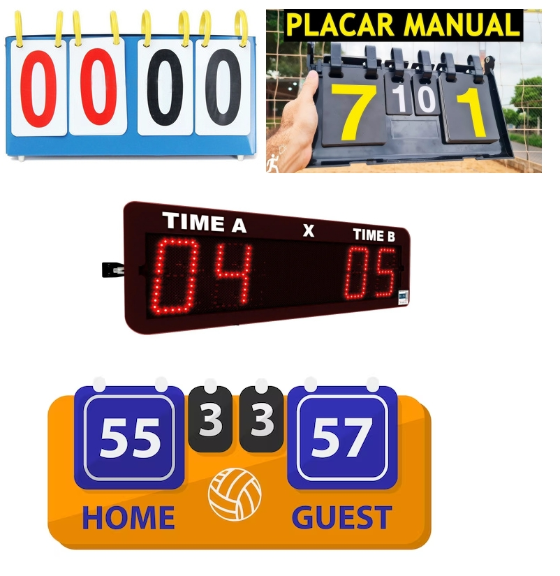

##  Faça um programa usando HTML, JS e CSS que possibilite o controle de um placar. Considere jogos com rede e raquete. Volei, beach tenis, tênis de mesa, etc.

  

Funcionalidades a serem implementadas

1) contar os pontos
2) contar os sets
3) exibir na tela, com fonte visível o placar. (parecido com a imagem)
4) contar os pontos (avançar, retroceder, zerar)
5) manter histórico dos pontos registrados (data e hora em que aconteceram)

Objetivo
 - usar Seletor de ID (#id), Seletor de elemento (h1, p, div, etc.) e Seletor de classe (.classe).

 mudei algo